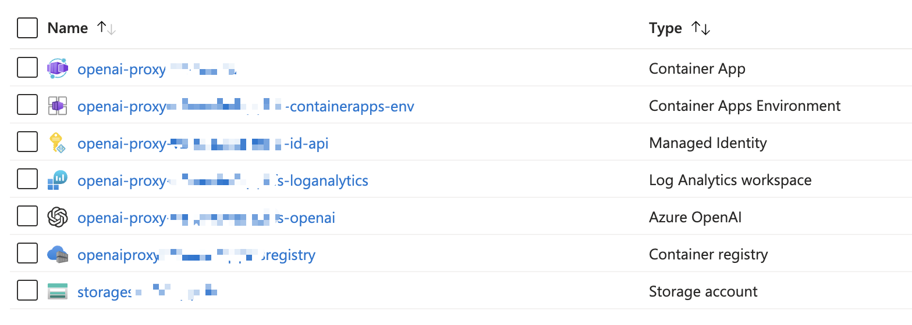
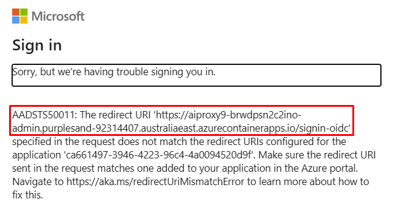

# OpenAI proxy service

The solution consists of three parts; the proxy service, the proxy playground, with a similar look and feel to the official Azure OpenAI Playground, and event admin.

## Deployment issues

1. Deploying the AI Proxy Admin Portal does not work on macOS on Apple Silicon. The workaround for now is to deploy the admin portal on a Windows, Linux machine, or from GitHub Codespaces.

## Setup

This repo is set up for deployment on Azure Container Apps using the configuration files in the `infra` folder.

### Prerequisites

1. An Azure subscription
2. Deployed Azure OpenAI Models


### Required software

Tested on Windows, macOS and Ubuntu 22.04.

Install:

1. [VS Code](https://code.visualstudio.com/)
2. [VS Code Dev Containers extension](https://marketplace.visualstudio.com/items?itemName=ms-vscode-remote.remote-containers)
3. [Docker](https://www.docker.com/products/docker-desktop)

## Create an Entra app registration

The AI Proxy admin is secured using Entra. You first need to register an application in your organizations Entra directory.

1. Log into the Azure Portal.
1. Select `Microsoft Entra ID` from the left-hand menu.
1. Select `+ Add` dropdown, then select `App registration`.
1. Name the registration, ensure `Accounts in this organizational directory only` is selected, and select `Register`.
1. Navigate to `Overview`, and make a note of the `Application (client) ID` as you will need it when you deploy the solution.

    

1. When you deploy the solution, you will need to create a client secret.
1. After the solution has been deployed, you will need to amend the app registration to add the redirect URI and enable the `ID tokens` under `Authentication`.

## Deploying

The recommended way to deploy this app is with Dev Containers. Install the [VS Code Remote Containers extension](https://marketplace.visualstudio.com/items?itemName=ms-vscode-remote.remote-containers) and Docker, open this repository in a container and you'll be ready to go.

!!! note

    Deploying the AI Proxy Admin Portal does not work on macOS on Apple Silicon. The workaround for now, is to deploy the solution from a Windows/ Linux machine, or GitHub Codespaces.

1. Ensure Docker is installed and running.
1. Clone the repo:

    ```shell
    git clone https://github.com/microsoft/azure-openai-service-proxy.git
    ```

1. Open the repo in VS Code.
1. You will be prompted to `Reopen in Container`, click the button to do so. This will build the container and open the repo in a container.
1. In the VS Code dev container, open a terminal and run the following commands to authenticate with Azure:

    ```shell
    azd auth login --use-device-code
    ```

    ```shell
    az login --use-device-code
    ```

1. Provision and deploy the proxy solution by running the following command in the terminal:

    ```shell
    azd up
    ```

    You will be prompted for the following:
    1. The environment name, keep the name short, max 7 characters to avoid invalid resource names being generated.
    1. Select a subscription from your Azure account.
    1. Select a location (like "eastus" or "sweden central"). Then azd will provision the resources in your account and deploy the latest code. Recommend deploying the proxy to the same location you plan to deploy your models.
    1. Enter a value for the 'authClientId' infrastructure parameter. This is the Entra App Registration `Application (client) ID` you created.
    1. Save the value in the environment for future use.
    3. Enter a value for the 'swaLocation' infrastructure parameter. Recommend selecting a location close to or the same as the Azure location you previously selected.
    4. Save the value in the environment for future use.

    On completion, the following Azure resources will be provisioned:

    

2. When `azd` has finished deploying you'll see a link to the Azure Resource Group created for the solution.

    The Admin and Playground links will be displayed when `azd up` completes.

    

## Entra App Registration

After the solution has been deployed, you will need to amend the app registration to add the redirect URI and enable the `ID tokens` under `Authentication`.

1. Navigate to the AI Proxy Admin portal URL. You'll find the URL from the output of the `azd up` command under `Deploying service admin`.
1. The log in will fail, but you will see the redirect URI in the error message. Copy the redirect URI, including the `/signin-oidc` prefix as you will need it when you update the app registration in the Azure Portal.

    

1. Log into the Azure Portal.
1. Select `Microsoft Entra ID` from the left-hand menu.
1. Select the app registration you created earlier.
1. Navigate to `Authentication`.
1. Add the redirect URI `https://<your-app-url>/signin-oidc`.
1. Enable `ID tokens` under `Advanced settings`.
1. Save the changes.

## Updating the deployed app

To make any changes to the app code, just run:

```shell
azd deploy
```

## Scaling the Proxy Service

The proxy service is stateless and scales vertically and horizontally. By default, the proxy service is configured to scale up to 10 replicas. The proxy service is configured to scale up to 10 replicas. The number of replicas can be changed from the Azure Portal or from the az cli. For example, to scale to 30 replicas using the az cli, change the:

```shell
az containerapp update -n $APP_NAME -g $RESOURCE_GROUP --subscription $SUBSCRIPTION_ID --replica 30
```

## Managing resources

You can configure multiple resources with the AI Proxy.

| Model deployment class | Resource | Description |
| ---------------------- | ------ | ----------- |
| `openai-chat` | gpt-35-turbo, gpt-35-turbo-16k, or newer | This is the model deployment class for the Azure OpenAI Chat Completions API. |
| `openai-completions` | davinci-002 or newer | This is the model deployment class for the Azure OpenAI Completions API. |
| `openai-embeddings` | text-embedding-ada-002 or newer | This is the model deployment class for the Azure OpenAI Embeddings API. |
| `azure-ai-search` | Azure AI Search index name | This allows for pass through access to an instance of Azure AI Search for Search/Query only. Note, recommend creating a read-only query key in Azure AI Search, if you want to use Semantic Ranking then you need to create a Standard SKU for Azure AI Search.|
| `openai-dall-e-3` | dall-3-e | This is the model deployment class for the Azure OpenAI Dall-e-3 models. |
| `openai-dall-e-2` | No model is deploy, just an Azure OpenAI resource in a location that supports the Images Generations API | This is the model deployment class for the Azure OpenAI Images Generations API. |

## Load balancing resources

You can deploy multiple instances of model with the same deployment name. For example, you can deploy multiple `gpt-35-turbo` models in difference Azure OpenAI resources with the same deployment name. The proxy will round robin across the resources with the same deployment name to balance the load.

## Deploy an Azure AI Resources

1. Open the Azure Portal.
1. Create a Azure resource group for your models. Naming suggestions include `ai-proxy-resources`.
1. Add AI resources to the resource group you created. See [Create and deploy an Azure OpenAI Service resource](https://learn.microsoft.com/azure/ai-services/openai/how-to/create-resource) for more information.
1. Make a note of the `endpoint_key` and `endpoint_url` as you'll need them when you configure resources for the AI Proxy.
