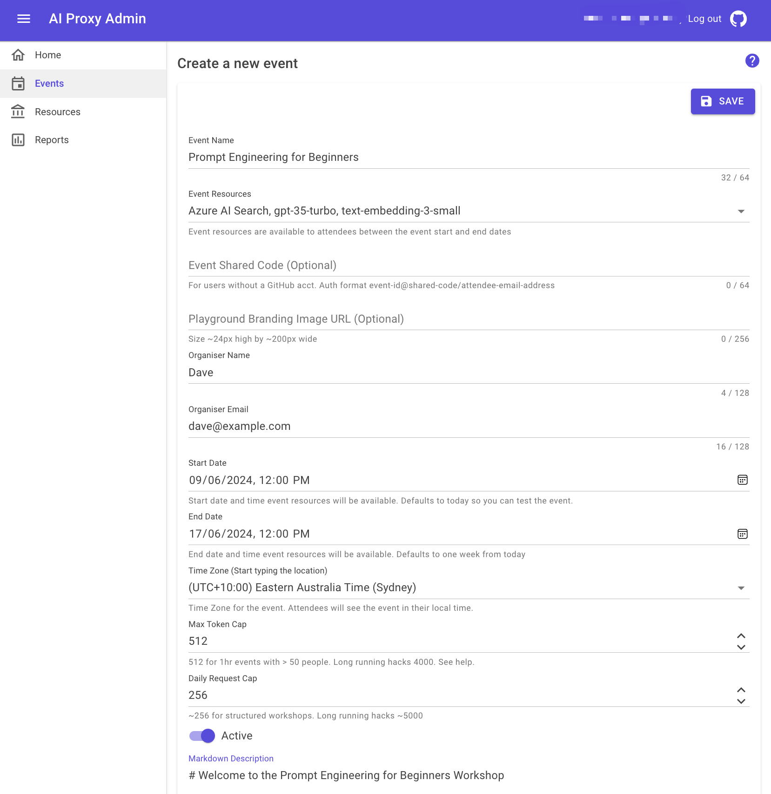
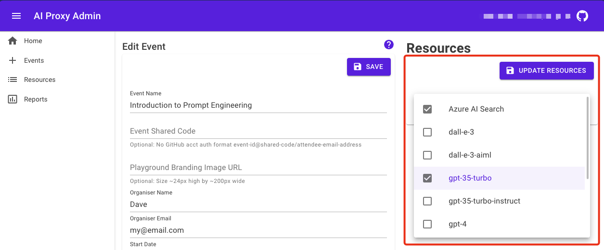

# Events

Once you have configured the resources, you can use the same resources for multiple events. This guide will walk you through the process of setting up events.

## Setting up events

From the AI Proxy Admin portal, you can create and manage events. An event is a time bound access to the AI Proxy service.

1. Sign into the AI Proxy Admin portal and authenticate using your organization's Entra credentials.
1. Select the `Events` tab, then add a new event.

    

1. Add the event details, including the event name, start and end date.

    1. **Event Name**: The name of the event.
    1. **Event URL text**: The text is used for the event URL. This text is used in AI Playground.
    1. **Event URL**: This URL is used in AI Playground to link to the workshop documentation.
    1. **Event Image URL**: The URL of the event image used to provide some branding for the event on the AI Playground.
    1. **Organizer Name**: The name of the event organizer.
    1. **Organizer Email**: The email of the event organizer.
    1. **Start Date**: The start date/time of the event. You can set the date/time using the date picker or by typing the date/time in the format `YYYY-MM-DDTHH:MM:SS`.
    1. **End Date**: The end date/time of the event. You can set the date/time using the date picker or by typing the date/time in the format `YYYY-MM-DDTHH:MM:SS`.
    1. **Max Token Cap**: The maximum number of tokens for a chat completion or completion API call. The `Max Token Cap` overrides the user set Max Token parameter in the API call and is used to limit and balance access to the Azure OpenAI resources for all attendees of the event.

        For a short 1 hour event, you might set the `Max Token Cap` to 512. For a longer multi hour/day event, you might set the `Max Token Cap` to 4000.

    1. **Daily Request Cap**: The maximum number of requests that can be made by a user to the Azure OpenAI resources per day. The `Daily Request Cap` resets at midnight UTC.
    1. **Description**: The `Markdown` description of the event. This description is displayed when an event attendee registers for a time bound API Key to access the AI Proxy service.
    1. Select `Save` to create the event.

    

## Assigning resources to events

Once you have created an event, you can assign resources to the event. This allows you to control the resources that are available to the event attendees.

1. Select the `Events` tab, then select the event you want to assign resources to.

    

1. From the event details page, select the `Resources` tab.
1. From the `Resources` tab, select the resources that you want to assign to the event.

    

1. Select on white space to close the resource selection dialog.
1. Select `UPDATE RESOURCES` to assign the resources to the event.
1. Select `Save` to save the event with the updated resources.
